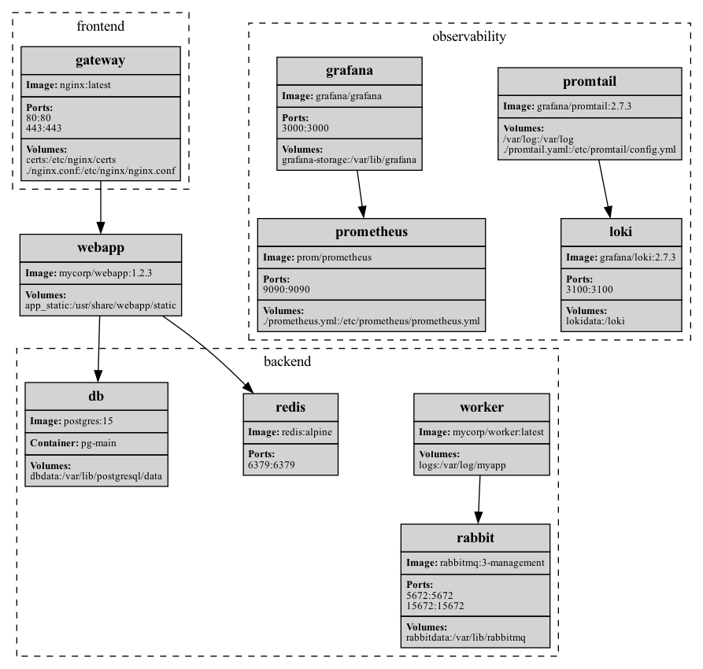
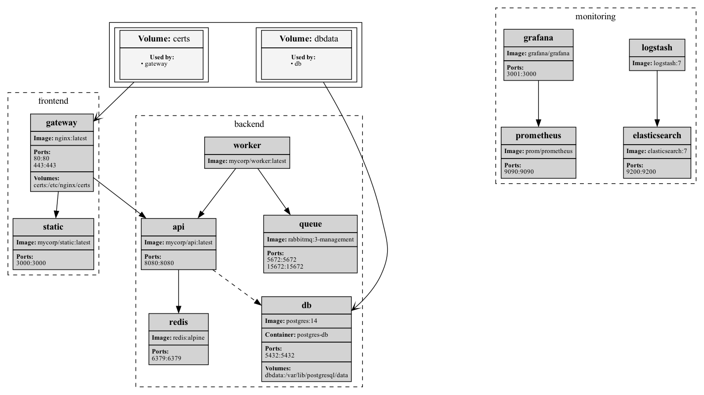

# 🐳 ComposeViz — Visualize compose files with Graphviz

**ComposeViz** is a lightweight CLI tool that parses your `docker-compose.yml` and generates clean, professional-looking visual diagrams in [Graphviz DOT](https://graphviz.org/) format (and optionally PNG/SVG/etc).  
Perfect for DevOps docs, architecture overviews, and impressing your teammates.

---

## ✨ Features

- Parses multi-service Compose files (v3+)
- Renders service nodes with metadata:
  - Image
  - Container name
  - Ports
  - Volumes (inline and named)
- Groups services into subgraphs by network (e.g., `labels.group`)
- Optionally renders named volumes as separate nodes with edges
- Outputs `.dot` or directly renders `.png`
- Customizable HTML-like templates for nodes and volumes

---

## 📦 Installation

```bash
git clone https://github.com/yourname/compose-viz.git
cd compose-viz
make build
```

## 🚀 Usage

### Basic

``` bash
./compose-viz -f docker-compose.yml
```

Outputs `composeGraph.dot` (by default). You can render it with Graphviz:

``` bash
dot -Tpng composeGraph.dot -o output.png
```
### With Volumes

``` bash
./compose-viz -f docker-compose.yml --render-volumes
```

This adds high-level named volumes as separate nodes and connects them to services.

---

## 🔧 Options

| Flag               | Type     | Description                                      | Default                          |
|--------------------|----------|--------------------------------------------------|----------------------------------|
| `-f`               | string   | Path to `docker-compose.yml` file               | `file`                           |
| `-o`               | string   | Path to output `.dot` file                      | `composeGraph.dot`               |
| `-t`               | string   | Title to be displayed on the rendered graph     | `defGraphTitle`                  |
| `-n`               | string   | Path to HTML template for node rendering        | `html/template/default_node.html` |
| `--render-volumes` | bool     | Whether to render named volumes as separate nodes | `false`                        |
| `-v`               | bool     | Enable verbose debug logging                    | `false`                          |
---

## 🧪 Example

``` bash
make run
```

This will build the binary, parse `complicated-compose.yml`, and output `output.png`.

Here's how a generated diagram might look:

<p align="center">
  
</p>

You can also enable volume rendering:

<p align="center">
  
</p>
---

## 🎨 Templates

Both service and volume nodes use HTML-like templates.
Customize them in:

- `html/template/default_node.html`
- `html/template/defaulqqt_volume.html`

Use Go template syntax with fields like `.ServiceName`, `.PortsString`, etc.

---

### Acknowledgements

This project relies on the excellent [emicklei/dot](https://github.com/emicklei/dot) library for generating Graphviz-compatible graph definitions in Go.

To render visual output (e.g., PNG or SVG), the [Graphviz](https://graphviz.org/) system tool must be installed on your machine:

- macOS: `brew install graphviz`
- Debian/Ubuntu: `apt install graphviz`
- Arch Linux: `pacman -S graphviz`
- Windows: [Graphviz Downloads](https://graphviz.org/download/)
---

## 📄 License

This project is licensed under the MIT License.  
You are free to use, modify, and distribute the software, provided that the original license and copyright notice are included.

See the [LICENSE](./LICENSE) file for full text.
